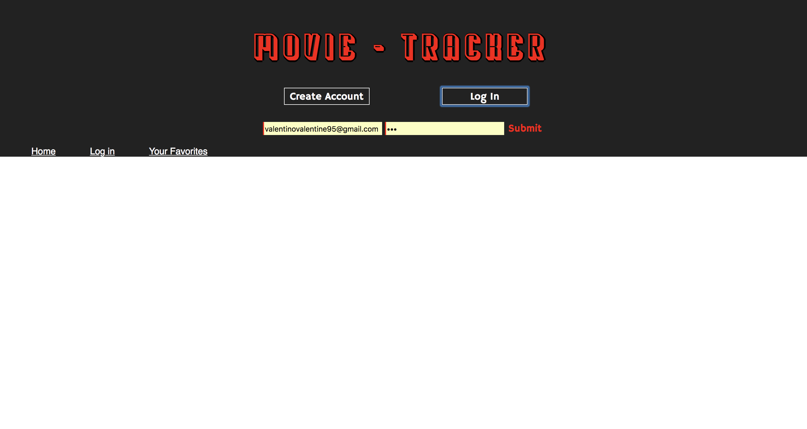
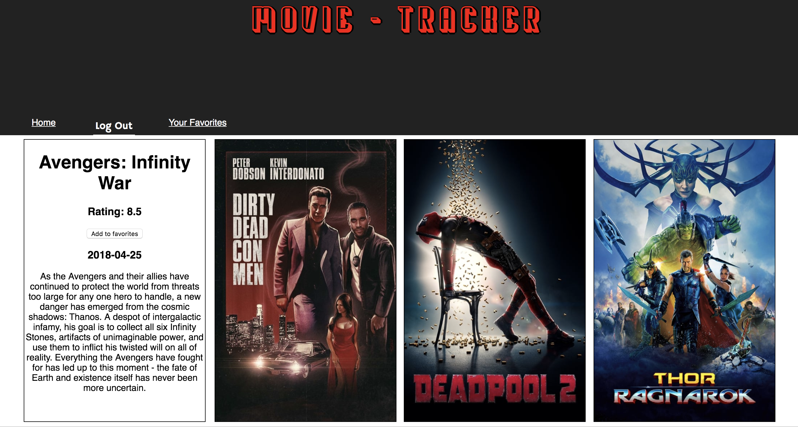

# Movie Tracker

This project is working off the The Movie DB API. The idea of the project is to be able to sign in as a user and save favorite movies.

### *Example* 

## Contributors

[Valentino Valentine] (https://github.com/valentinovtino)
[Helen Dechat] (https://github.com/hdechat)
[Cameron Buscher] (https://github.com/YayFiber)

_(**Turing School of Software & Design Front-end Engineering project - Mod 3:** [Movie Tracker Project Spec](https://github.com/turingschool-examples/movie-tracker))_ 

